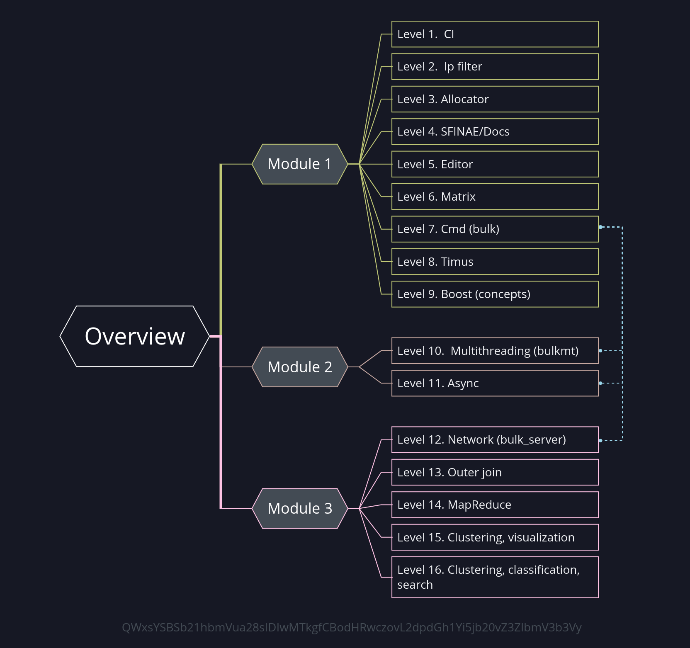

This repository contains a number of tasks covering some aspects of modern C++ development  
Doxygen-generated documentation is available [here ](https://gvenewour.github.io/miscellaneous/)

## Tasks overview
